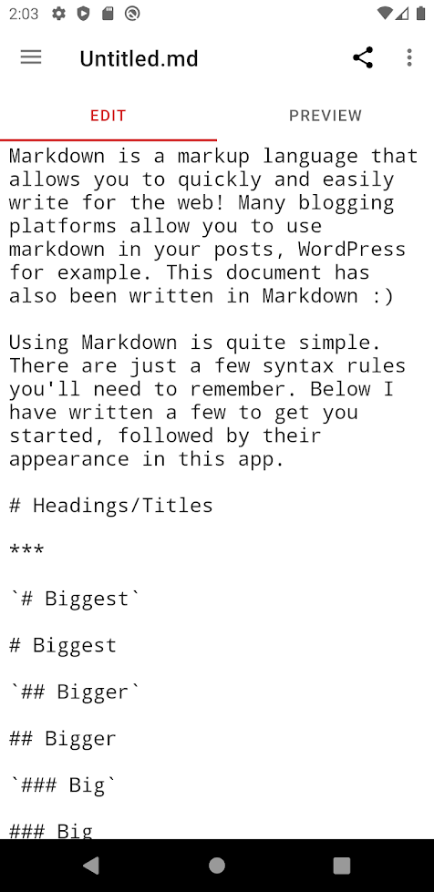
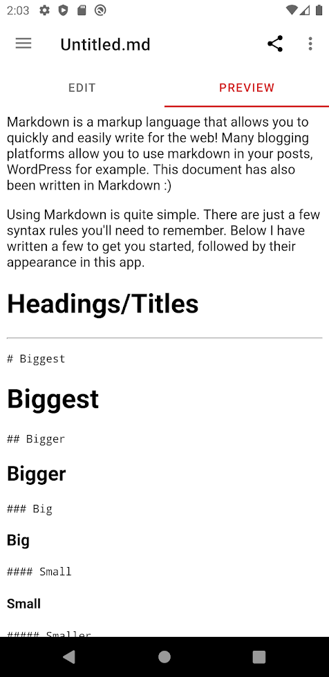
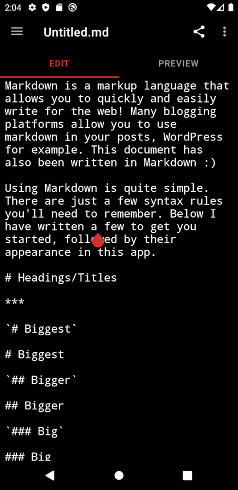
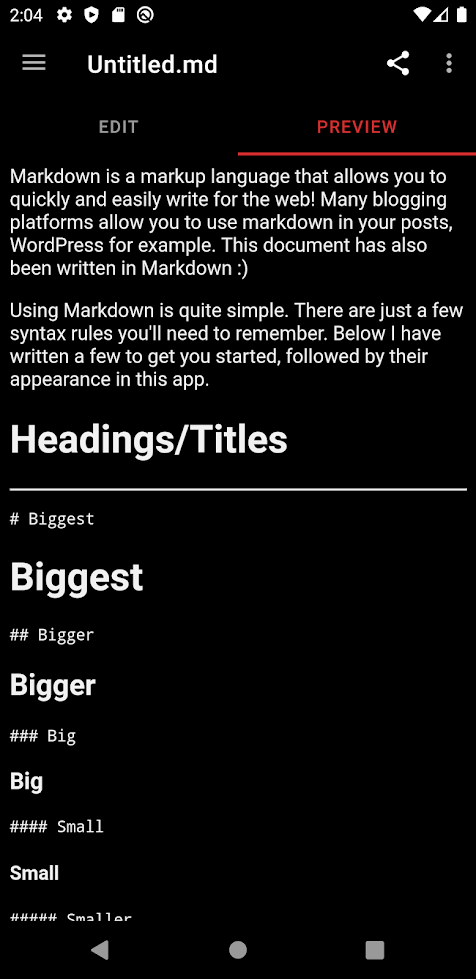

# [Simple Markdown](https://wbrawner.com/portfolio/simple-markdown/)

[](https://github.com/wbrawner/SimpleMarkdown/actions/workflows/android.yml)

<p>




</p>

Simple Markdown is an open source Markdown editor.

<a href='https://play.google.com/store/apps/details?id=com.wbrawner.simplemarkdown&pcampaignid=pcampaignidMKT-Other-global-all-co-prtnr-py-PartBadge-Mar2515-1'></a>
[](https://f-droid.org/packages/com.wbrawner.simplemarkdown.free/)

## Building

Using Android Studio is the preferred way to build the project. To build from the command line, you can run

    ./gradlew assembleFreeDebug

### Crashlytics

SimpleMarkdown makes use of Firebase Crashlytics for error reporting. You'll need to follow the 
[Get started with Firebase Crashlytics](https://firebase.google.com/docs/crashlytics/get-started?platform=android) guide in order to build the project.

## License

```
   Copyright 2017-2022 William Brawner

   Licensed under the Apache License, Version 2.0 (the "License");
   you may not use this file except in compliance with the License.
   You may obtain a copy of the License at

       http://www.apache.org/licenses/LICENSE-2.0

   Unless required by applicable law or agreed to in writing, software
   distributed under the License is distributed on an "AS IS" BASIS,
   WITHOUT WARRANTIES OR CONDITIONS OF ANY KIND, either express or implied.
   See the License for the specific language governing permissions and
   limitations under the License.
```

## Libraries

- [AndDown](https://github.com/commonsguy/cwac-anddown)
- [Hoedown](https://github.com/hoedown/hoedown)
