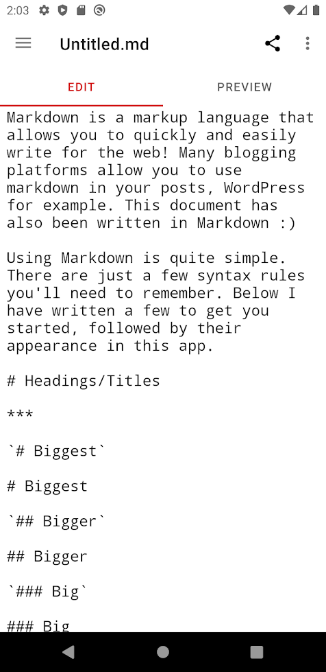
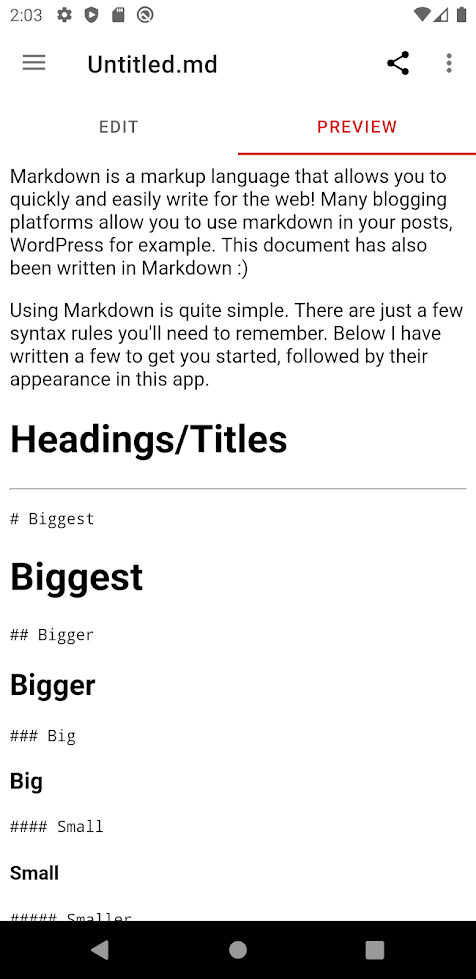
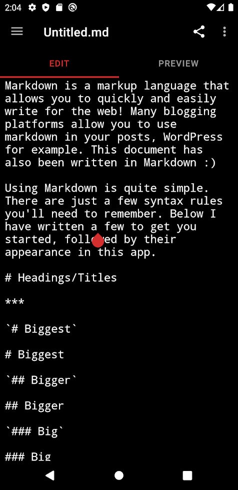
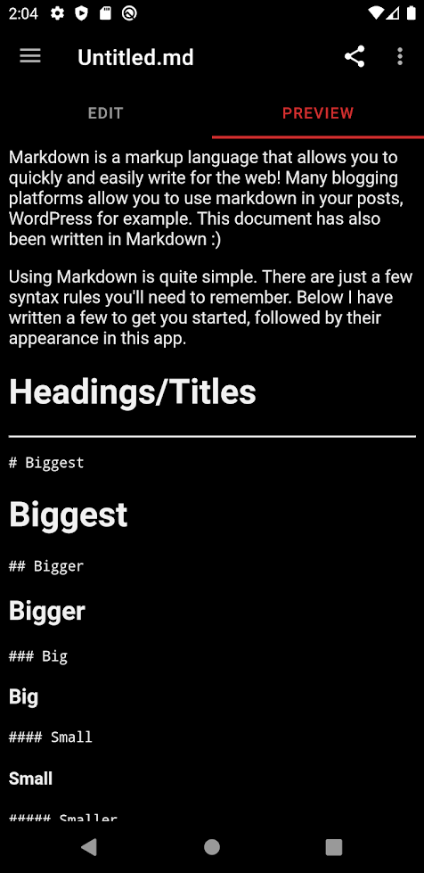

# Simple Markdown

[](https://git.wbrawner.com/wbrawner/SimpleMarkdown/actions?workflow=pull_request.yml)
[](https://hosted.weblate.org/engage/simplemarkdown/)

<p>




</p>

Simple Markdown is a free and open source Markdown editor.

<a href='https://play.google.com/store/apps/details?id=com.wbrawner.simplemarkdown&pcampaignid=pcampaignidMKT-Other-global-all-co-prtnr-py-PartBadge-Mar2515-1'></a>
[](https://f-droid.org/packages/com.wbrawner.simplemarkdown.free/)

## Building

Using Android Studio is the preferred way to build the project. To build from the command line, you can run

    ./gradlew assembleFreeDebug

## Contributing

GitHub is the primary interaction point though just a mirror for me. Feel free to open a PR there or send me a patch via email.

### AI Usage

SimpleMarkdown is proudly handwritten. The use of LLMs for any purpose is not welcome here.

### Translations

Translations are powered by [Weblate](https://weblate.org/). If you would like
to contribute translations for a language you speak, please open a PR directly
or contribute via the [Weblate project](https://hosted.weblate.org/engage/simplemarkdown).

## License

```
   Copyright 2017-2026 William Brawner

   Licensed under the Apache License, Version 2.0 (the "License");
   you may not use this file except in compliance with the License.
   You may obtain a copy of the License at

       http://www.apache.org/licenses/LICENSE-2.0

   Unless required by applicable law or agreed to in writing, software
   distributed under the License is distributed on an "AS IS" BASIS,
   WITHOUT WARRANTIES OR CONDITIONS OF ANY KIND, either express or implied.
   See the License for the specific language governing permissions and
   limitations under the License.
```

